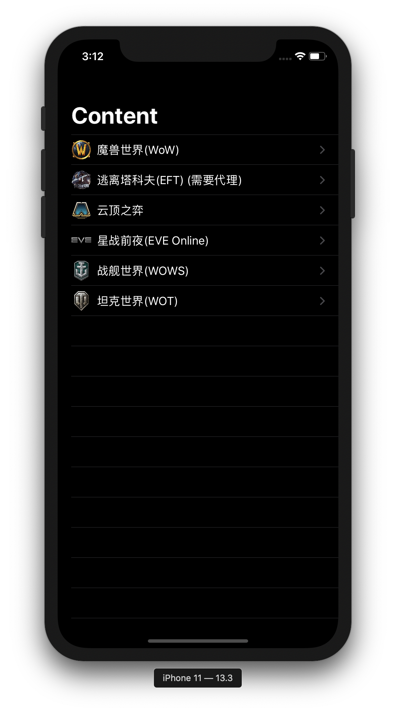
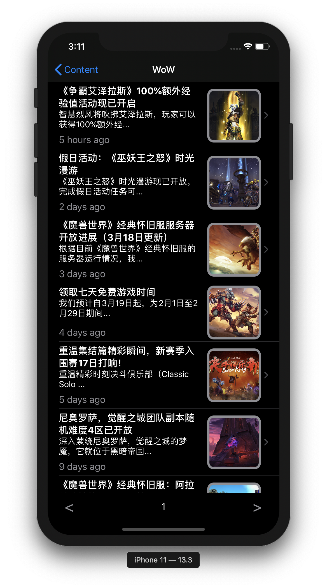

# aiGameNews

</img>

这是一个为玩家提供游戏资讯的iOS应用程序, 囊括国内各大网游.
// 目前内容仍在增加中🔨

## Using/Installing
克隆此仓库并打开Xcode项目文件, 修改bundle identifier, 构建并运行在你的设备上.

## Features
支持iOS13+ Dark Mod
使用SwiftUI框架构建
多线程爬取图片

</img>

## Dependence
[Kanna](https://github.com/tid-kijyun/Kanna)

#### Files
*News.swift 最终呈现的单项新闻页面
*ItemsInList.swift 新闻列表
*ListItem.swift 新闻列表项
*WebCrawler.swift 负责爬取相关信息

异步爬取图片:
AsyncImage.swift
ImageCache.swift
ImageLoader.swift